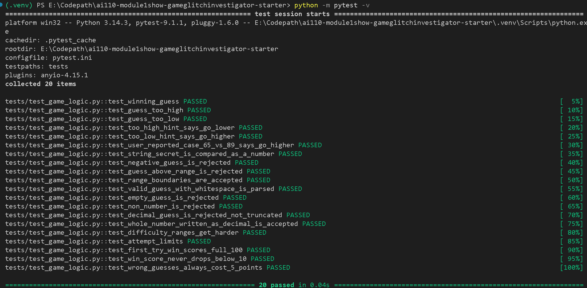

# 🎮 Game Glitch Investigator: The Impossible Guesser

## 🚨 The Situation

You asked an AI to build a simple "Number Guessing Game" using Streamlit.
It wrote the code, ran away, and now the game is unplayable. 

- You can't win.
- The hints lie to you.
- The secret number seems to have commitment issues.

## 🛠️ Setup

1. Install dependencies: `pip install -r requirements.txt`
2. Run the app: `python -m streamlit run app.py`
3. Run the tests: `python -m pytest -v`

## 🕵️‍♂️ Your Mission

1. **Play the game.** Open the "Developer Debug Info" tab in the app to see the secret number. Try to win.
2. **Find the State Bug.** Why does the secret number change every time you click "Submit"? Ask ChatGPT: *"How do I keep a variable from resetting in Streamlit when I click a button?"*
3. **Fix the Logic.** The hints ("Higher/Lower") are wrong. Fix them.
4. **Refactor & Test.** - Move the logic into `logic_utils.py`.
   - Run `pytest` in your terminal.
   - Keep fixing until all tests pass!

## 📝 Document Your Experience

- [x] Describe the game's purpose.
- [x] Detail which bugs you found.
- [x] Explain what fixes you applied.

### What the game is

It's a number guessing game made with Streamlit. The game picks a secret number and you try to guess it. After each guess it tells you to go higher or lower. You pick a difficulty:

- **Easy:** 1 to 20, 6 guesses
- **Normal:** 1 to 100, 8 guesses
- **Hard:** 1 to 200, 5 guesses

The faster you guess it, the more points you get. Guessing right on the first try gives 100 points, and every wrong guess costs 5. The starting code was written by an AI and had a lot of bugs, so my job was to find them, fix them and write tests to prove they're fixed.

### Bugs I found

| Bug | What I saw | Why it happened |
|-----|-----------|-----------------|
| Hints were backwards | I guessed 65, the answer was 89, and it told me to go lower | The "Go HIGHER" and "Go LOWER" messages were swapped |
| Hints were sometimes random | Some hints were wrong in weird ways | On every second guess, the code turned the secret into text, so it compared like words ("9" came out bigger than "80") |
| New Game button didn't work | It kept saying "Game over" | The button never reset the game status, score or guess history |
| Attempts counter was wrong | It started at 7 instead of 8, didn't go down after my first guess, and ended the game at "1 left" | Attempts started at 1 instead of 0, and the counter was shown before my guess was counted |
| Debug info was one guess behind | My guess only showed up after I made the next one | Same problem: the debug section was shown before my guess was saved |
| Negative numbers were accepted | -50 was accepted and it said "Go Lower" | The game never checked if the guess was inside the range |
| Hard was easier than Normal | Hard's range was smaller | Hard was 1 to 50 and Normal was 1 to 100 |
| Smaller bugs | | The message always said "1 and 100" no matter the difficulty, 50.9 turned into 50, the score sometimes went *up* on a wrong guess, and typos used up a guess |

### How I fixed them

- Moved the game logic out of `app.py` into `logic_utils.py`, so the logic is separate from the screen code and can be tested.
- Swapped the hint messages back and made the game always compare numbers as numbers, not text.
- Made New Game fully reset everything: a new secret, attempts, score, status and history.
- Made attempts start at 0 and only count real guesses, not typos.
- Made the attempts counter and debug section update after the guess is handled, so they're always up to date.
- Added checks so guesses outside the range, decimals, empty input and letters get a clear error message.
- Changed Hard to 1 to 200, fixed the range message, and made the scoring the same for every wrong guess.
- Added 17 new tests on top of the 3 starter tests.

## 📸 Demo Walkthrough

Here is a sample game on Normal (1 to 100, 8 guesses). The secret number is 63.

1. The game starts and says "Guess a number between 1 and 100. Attempts left: 8".
2. I guess **40**. It says **"Go HIGHER!"** and attempts left goes down to 7 right away. Score: -5.
3. I guess **80**. It says **"Go LOWER!"**. Attempts left: 6. Score: -10.
4. I guess **-5**. It says **"Your guess must be between 1 and 100."** It doesn't count as a guess, so I still have 6.
5. I type **abc**. It says **"That is not a number."** I still have 6.
6. I guess **60**. It says **"Go HIGHER!"**. Attempts left: 5. Score: -15.
7. I guess **63**. It says **"Correct!"**, balloons show up, and it says **"You won! The secret was 63. Final score: 55"**.
8. If I try to guess again, it says "You already won. Start a new game to play again."
9. I click **New Game**. Everything resets: 8 attempts, score 0, and a new secret number.

**Screenshot** *(optional)*: <!-- Insert a screenshot of your fixed, winning game here -->

## 🧪 Test Results

(.venv) PS E:\Codepath\ai110-module1show-gameglitchinvestigator-starter> python -m pytest -v                                                       
============================================================== test session starts ===============================================================
platform win32 -- Python 3.14.3, pytest-9.1.1, pluggy-1.6.0 -- E:\Codepath\ai110-module1show-gameglitchinvestigator-starter\.venv\Scripts\python.exe
cachedir: .pytest_cache
rootdir: E:\Codepath\ai110-module1show-gameglitchinvestigator-starter
configfile: pytest.ini
testpaths: tests
plugins: anyio-4.15.1
collected 20 items                                                                                                                                

tests/test_game_logic.py::test_winning_guess PASSED                                                                                         [  5%]
tests/test_game_logic.py::test_guess_too_high PASSED                                                                                        [ 10%]
tests/test_game_logic.py::test_guess_too_low PASSED                                                                                         [ 15%]
tests/test_game_logic.py::test_too_high_hint_says_go_lower PASSED                                                                           [ 20%]
tests/test_game_logic.py::test_too_low_hint_says_go_higher PASSED                                                                           [ 25%]
tests/test_game_logic.py::test_user_reported_case_65_vs_89_says_go_higher PASSED                                                            [ 30%]
tests/test_game_logic.py::test_string_secret_is_compared_as_a_number PASSED                                                                 [ 35%]
tests/test_game_logic.py::test_negative_guess_is_rejected PASSED                                                                            [ 40%]
tests/test_game_logic.py::test_guess_above_range_is_rejected PASSED                                                                         [ 45%]
tests/test_game_logic.py::test_range_boundaries_are_accepted PASSED                                                                         [ 50%]
tests/test_game_logic.py::test_valid_guess_with_whitespace_is_parsed PASSED                                                                 [ 55%]
tests/test_game_logic.py::test_empty_guess_is_rejected PASSED                                                                               [ 60%]
tests/test_game_logic.py::test_non_number_is_rejected PASSED                                                                                [ 65%]
tests/test_game_logic.py::test_decimal_guess_is_rejected_not_truncated PASSED                                                               [ 70%]
tests/test_game_logic.py::test_whole_number_written_as_decimal_is_accepted PASSED                                                           [ 75%]
tests/test_game_logic.py::test_difficulty_ranges_get_harder PASSED                                                                          [ 80%]
tests/test_game_logic.py::test_attempt_limits PASSED                                                                                        [ 85%]
tests/test_game_logic.py::test_first_try_win_scores_full_100 PASSED                                                                         [ 90%]
tests/test_game_logic.py::test_win_score_never_drops_below_10 PASSED                                                                        [ 95%]
tests/test_game_logic.py::test_wrong_guesses_always_cost_5_points PASSED                                                                    [100%]

=============================================================== 20 passed in 0.04s ===============================================================

## 🚀 Stretch Features

- [ ] [If you choose to complete Challenge 4, describe the Enhanced UI changes here — a screenshot is optional]
